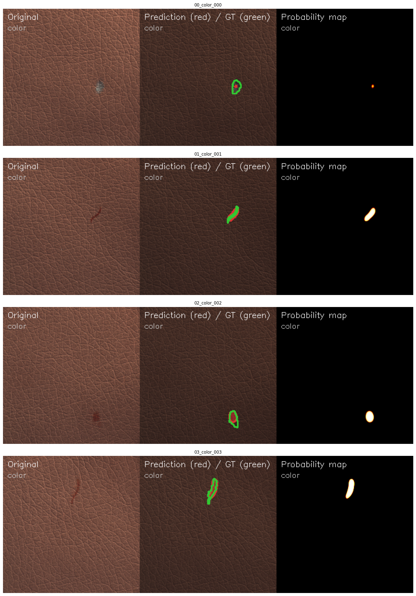

# Industrial Surface Defect Detection using U-Net

Pixel-level industrial surface defect segmentation using a U-Net architecture trained on the [MVTec Anomaly Detection dataset](https://www.mvtec.com/company/research/datasets/mvtec-ad).

---

## Overview

This project trains a U-Net convolutional segmentation model to localize manufacturing defects at the pixel level. Given an image of an industrial surface, the model outputs a binary mask highlighting exactly which pixels contain defects.

Each pixel in the output mask gets a probability between 0 and 1 — pixels above 0.5 are classified as defective. The model is trained separately for each of the 15 MVTec categories, with one checkpoint saved per category.

**Results on leather category (50 epochs):**

| Metric   | Score  |
|----------|--------|
| Val Dice | 0.6537 |
| Val IoU  | ~0.45  |

---

## How to replicate

### 1. Clone the repository

    git clone https://github.com/AshishKale1234/Industrial_Surface_Detection_using_U-Net.git
    cd Industrial_Surface_Detection_using_U-Net

### 2. Set up the environment

    conda create -n defect_seg python=3.10 -y
    conda activate defect_seg

Install PyTorch — pick the right CUDA version for your GPU:

    # CUDA 11.8
    pip install torch torchvision --index-url https://download.pytorch.org/whl/cu118

    # CUDA 12.1
    pip install torch torchvision --index-url https://download.pytorch.org/whl/cu121

    # CPU only
    pip install torch torchvision --index-url https://download.pytorch.org/whl/cpu

Install remaining dependencies:

    pip install -r requirements.txt

Verify GPU is available:

    python -c "import torch; print(torch.cuda.is_available())"

---

### 3. Download the dataset

Go to [mvtec.com/company/research/datasets/mvtec-ad](https://www.mvtec.com/company/research/datasets/mvtec-ad), fill in the short registration form and download `mvtec_anomaly_detection.tar.xz` (~5GB).

Extract it into the data/ folder:

    mkdir data
    tar -xf mvtec_anomaly_detection.tar.xz -C data/

After extraction your folder structure should look like this:

    data/
    ├── bottle/
    │   ├── train/
    │   │   └── good/              # defect-free training images
    │   └── test/
    │       ├── good/              # defect-free test images
    │       ├── broken_large/      # defect images
    │       └── ground_truth/      # binary masks (white = defect pixel)
    ├── leather/
    ├── metal_nut/
    └── ...

Verify the dataset loaded correctly:

    python -c "
    from pathlib import Path
    cats = [d.name for d in Path('data').iterdir() if d.is_dir()]
    print(f'Categories found: {len(cats)}')
    print(cats)
    "

You should see 15 categories.

---

### 4. Train the model

Train on a single category(example 'leather'):

    python train_all.py --data_root ./data --category leather --epochs 50

Train on all 15 categories sequentially:

    python train_all.py --data_root ./data --epochs 50

All available arguments:

| Argument | Default | Description |
|----------|---------|-------------|
| --data_root | ./data | Path to MVTec data folder |
| --category | all 15 | Single category to train on |
| --epochs | 50 | Number of training epochs |
| --batch_size | 8 | Images per batch |
| --img_size | 256 | Resize images to N x N |
| --lr | 1e-3 | Initial learning rate |

Checkpoints are saved to `outputs/checkpoints/best_{category}.pth` whenever validation Dice improves. Only the best checkpoint per category is kept.

---

### 5. Run inference

After training, run inference and generate defect overlay visualizations:

    import torch, sys
    sys.path.append('./src')
    from inference import load_model, run_inference_batch

    device = torch.device('cuda' if torch.cuda.is_available() else 'cpu')

    model = load_model('outputs/checkpoints/best_leather.pth', device)

    run_inference_batch(
        model      = model,
        data_root  = './data',
        category   = 'leather',
        output_dir = './outputs/visualizations/leather',
        device     = device,
        n_samples  = 8,
    )

Each output image shows three panels side by side:

- Left — original surface image
- Middle — red filled region is predicted defect, green contour is ground truth boundary
- Right — probability heatmap where bright pixels = high confidence defect

---

### 6. Running on Google Colab

If you do not have a local NVIDIA GPU this project runs on Google Colab's free T4:

1. Go to colab.research.google.com
2. Runtime → Change runtime type → T4 GPU
3. Mount Google Drive:

        from google.colab import drive
        drive.mount('/content/drive')
        PROJECT_ROOT = '/content/drive/MyDrive/Industrial_Surface_Detection_using_U-Net'

4. Clone the repo:

        !git clone https://github.com/AshishKale1234/Industrial_Surface_Detection_using_U-Net.git

5. Download the MVTec dataset, place it in data/ on your Drive
6. Run training and inference — checkpoints save to Drive and survive session resets

---

## Architecture

U-Net with 4 encoder levels, bottleneck, and symmetric decoder (~31M parameters):

    Input [3 x 256 x 256]
        → Encoder block 1 : DoubleConv → 64 x 256 x 256  → MaxPool → 64 x 128 x 128
        → Encoder block 2 : DoubleConv → 128 x 128 x 128 → MaxPool → 128 x 64 x 64
        → Encoder block 3 : DoubleConv → 256 x 64 x 64   → MaxPool → 256 x 32 x 32
        → Encoder block 4 : DoubleConv → 512 x 32 x 32   → MaxPool → 512 x 16 x 16
        → Bottleneck       : DoubleConv → 1024 x 16 x 16
        → Decoder block 1  : Upsample + concat skip → DoubleConv → 512 x 32 x 32
        → Decoder block 2  : Upsample + concat skip → DoubleConv → 256 x 64 x 64
        → Decoder block 3  : Upsample + concat skip → DoubleConv → 128 x 128 x 128
        → Decoder block 4  : Upsample + concat skip → DoubleConv → 64 x 256 x 256
        → Output conv 1x1 + Sigmoid → 1 x 256 x 256

Each DoubleConv block = Conv2d → BatchNorm2d → ReLU → Conv2d → BatchNorm2d → ReLU

Skip connections concatenate encoder feature maps to the matching decoder level, giving the decoder access to fine spatial detail that would otherwise be lost during downsampling.

---

## Loss function

    total_loss = 0.5 x BCE + 0.5 x Dice

BCE (Binary Cross Entropy) penalizes per-pixel prediction errors. Dice Loss optimizes mask overlap directly and heavily penalizes predicting all-background — critical because defect pixels are only 5-10% of all pixels in the dataset.

---

## Project structure

    Industrial_Surface_Detection_using_U-Net/
    ├── src/
    │   ├── dataset.py      # MVTec Dataset class and augmentation pipeline
    │   ├── model.py        # U-Net architecture (DoubleConv, EncoderBlock, DecoderBlock, UNet)
    │   ├── losses.py       # BCEDiceLoss, DiceLoss, dice_score, iou_score
    │   ├── train.py        # Training loop with checkpointing and LR scheduling
    │   └── inference.py    # Inference and OpenCV defect overlay visualization
    ├── outputs/
    │   └── visualizations/ # Saved inference overlay images
    ├── train_all.py        # Entry point — trains one model per category
    ├── requirements.txt
    └── README.md

Note: data/ and outputs/checkpoints/ are excluded from the repo. Download the dataset separately and checkpoints are generated locally after training.

---

## Dependencies

| Package | Version |
|---------|---------|
| torch | >=2.0.0 |
| torchvision | >=0.15.0 |
| opencv-python | >=4.7.0 |
| albumentations | >=1.3.0 |
| matplotlib | >=3.7.0 |
| tqdm | >=4.65.0 |
| scikit-learn | >=1.2.0 |
| Pillow | >=9.5.0 |

---

## Key implementation details

- Albumentations for augmentation — automatically syncs spatial transforms across image and mask so they never get misaligned
- ReduceLROnPlateau scheduler — halves the learning rate when validation loss stops improving for 5 epochs
- Best checkpoint saving — model is saved only when validation Dice improves, not at every epoch, so the checkpoint is always the best version seen during training
- Zero masks for defect-free images — good/ images are paired with all-zero masks to teach the model what clean surfaces look like
- ConvTranspose2d for learned upsampling — decoder learns the best way to expand spatial resolution rather than using fixed bilinear interpolation

---

## References

- U-Net: Convolutional Networks for Biomedical Image Segmentation — Ronneberger et al., 2015 — https://arxiv.org/abs/1505.04597
- MVTec AD: A Comprehensive Real-World Dataset for Unsupervised Anomaly Detection — Bergmann et al., 2019 — https://www.mvtec.com/company/research/datasets/mvtec-ad
